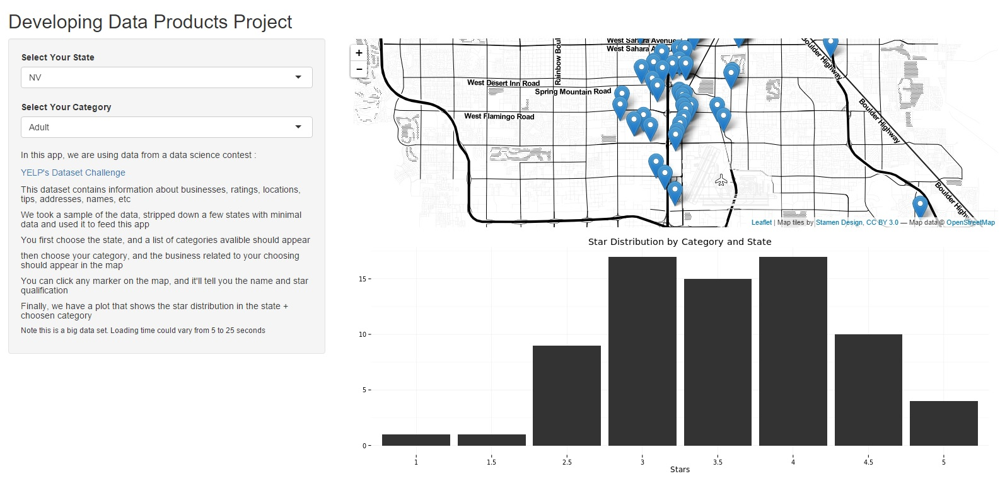
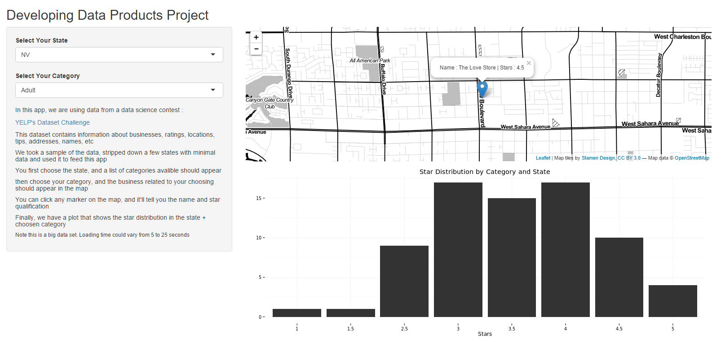

Developing Data Products Project
========================================================
author: Dan Garcia
date: 20 / October / 2015
transition: rotate


Adquiring Data
========================================================

The assigment was a come up with any shiny project we desired, so we decided to grab data from YELP Dataset Challenge and have some fun with it. You can find the data set here: http://www.yelp.com/dataset_challenge

After cleaning the data set, we decided to keep the "business" dataset. From it, we used the following fields for the shiny app:
- State       
- Category
- Coordinates
- Rating
- Name of Business

Analyzing the Data
========================================================
We then decided to strip some states from the application that had very few entries, and left with the following states and more than 700 categories (Only first 15 shown):


```
[1] "AZ"  "PA"  "NC"  "WI"  "NV"  "QC"  "EDH"
```

```
 chr [1:766] "Doctors" "Health & Medical" "Nightlife" "Active Life" "Mini Golf" "Golf" "Shopping" "Home Services" "Internet Service Providers" "Mobile Phones" "Professional Services" "Electronics" "Bars" "American (New)" "Lounges" ...
```

Maping the Information
========================================================
We then filtered each category that were present per state, and plot the map with the markers. Each time a new state/category is selected, a new map and set of markers is drawn. Here is a picture :



Markers and Information
========================================================
Finally, we can zoom the map and click on the markers. 
When that is done, information about the marker is shown. Name and rating (stars) will be displayed:




